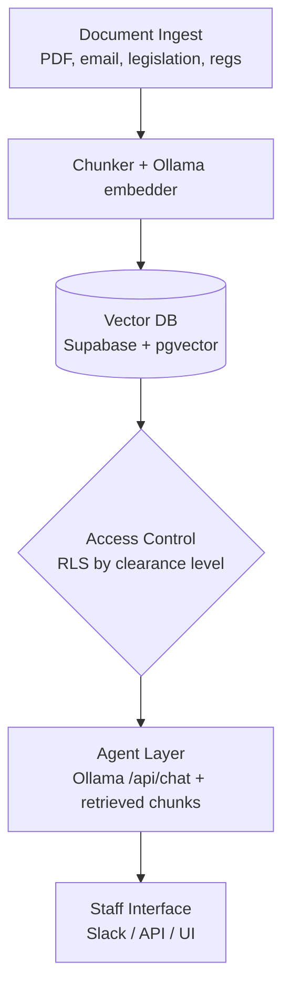

# LAB: Congressional Agent: Legality Checker


**Focal agent:** Option A: The Legality Checker

---

## Task 1: Focal Agent: The Legality Checker

### Documents retrieved

- **Codified federal law:** U.S. Code sections as published in the internal legislative corpus (bill text, enrolled bills, Statutes at Large references where available).
- **Congressional Research Service (CRS) and GAO products** already cleared for staff use (reports, legal sidebars), when present in the knowledge base.
- **Selected case law:** Supreme Court and circuit-level opinions that are part of the subscribed corpus (full text or official summaries, depending on license).
- **Constitutional provisions** and **joint resolutions** where indexed.
- **Agency regulations** (CFR) and **Federal Register** entries that are explicitly linked to the user’s proposed action or retrieved via hybrid search (keyword plus embedding) over metadata-tagged regulatory text.

Retrieval is **hybrid**: metadata filters (jurisdiction, date, document type) narrow the candidate set, then **vector similarity** (pgvector) ranks chunks. Nothing is retrieved from outside the approved Supabase tables (no extra tools beyond the course stack).

### How uncertainty is handled

- The model may only assert a legal conclusion when **retrieved text** supports it, with **inline citations** (document ID, section, page or paragraph anchor).
- **Four outcome buckets** are mandatory: *clearly consistent*, *clearly inconsistent*, *legally uncertain* (conflicting or insufficient authority), *outside retrieved knowledge* (corpus gap).
- If chunks are **low relevance** or **contradictory**, the agent must say so and **refuse** a binary “legal / illegal” answer.
- **Confidence** is calibrated to evidence strength (single district case vs. controlling statute; age of precedent; whether issue is unsettled circuit split).
- Optional: a **human-readable “evidence table”** lists each retrieved source and what it does or does not resolve.

### Output shape

Structured sections:

1. **Question restatement** (one sentence).
2. **Applicable authorities** (bulleted, each with citation anchor).
3. **Analysis** (short prose mapping facts in the memo to authorities).
4. **Conclusion** (one of the four buckets above).
5. **Risks and gaps** (what was not in the corpus, what OLC or litigation might still need).
6. **CONFIDENCE** and **RECOMMENDED NEXT STEP** (as in the prompt).

### System prompt (production draft)

```
You are a legislative legal analyst assistant operating inside a closed congressional legal knowledge base. You assess whether a proposed action described in the user’s memo is consistent with the law as reflected ONLY in documents returned by the retrieval system for this session.

Operating rules:
1. Ground every legal claim in retrieved text. For each proposition, cite: document identifier, section or unit label, and paragraph or page anchor when available. If you cannot ground a claim, state that it is not supported by retrieval.
2. Use exactly one primary conclusion label:
   - CLEARLY CONSISTENT: retrieved authorities directly support lawfulness for this type of action, with no strong contrary authority in the retrieved set.
   - CLEARLY INCONSISTENT: retrieved authorities directly prohibit or foreclose the action, with no strong contrary authority in the retrieved set.
   - LEGALLY UNCERTAIN: retrieved authorities conflict, are distinguishable, or leave material gaps; or the fact pattern needs facts not in the memo.
   - OUTSIDE RETRIEVED KNOWLEDGE: the corpus returned no adequate authority on the controlling issue.
3. Never invent citations, docket numbers, or quotations. If the user names a statute or case, verify it appears in retrieved content before relying on it; otherwise treat it as unverified user input only.
4. If retrieval is thin (few chunks, low similarity, or mostly secondary sources), say so explicitly and prefer LEGALLY UNCERTAIN or OUTSIDE RETRIEVED KNOWLEDGE over false precision.
5. Do not rely on training-data law that is not in retrieved documents. Treat general legal “common knowledge” as insufficient for CLEARLY CONSISTENT / CLEARLY INCONSISTENT.
6. Separate “policy wisdom” from “legal conclusion.” Policy discussion belongs in a short optional subsection labeled NON-LEGAL CONSIDERATIONS and must not change the legal conclusion label.
7. Output format:
   - RESTATED QUESTION
   - AUTHORITIES (bulleted citations + one-line relevance each)
   - ANALYSIS
   - CONCLUSION: [label from rule 2]
   - GAPS AND LIMITATIONS
   - CONFIDENCE: [High | Medium | Low] with one sentence explaining why
   - RECOMMENDED NEXT STEP: [e.g., “Refer to House Office of General Counsel” / “Request OLC review” / “Gather additional facts on …”]

High confidence requires multiple strong, on-point retrieved sources and absence of material contradiction in the retrieved set. Low confidence applies when you depend on a single weak source, outdated materials, or clear corpus gaps.
```

---

## Task 2: Architecture

### Design questions (answered)

- **Ingestion and chunking:** Ingest PDFs (OCR where needed), email exports, bill text, amendments, constituent mail (where policy-relevant and approved), committee prints, and CRS/GAO PDFs. Store **full text** in **Supabase Storage** buckets; create **overlapping chunks** (for example 512 to 1024 tokens, 10% to 15% overlap) with section-aware boundaries where structure exists. Maintain **human-authored or validated summaries** for long statutes and opinions in a separate table for optional retrieval; the agent’s default context is **chunks**, not summaries alone.

- **Access control:** Enforce at the **data layer** with **Supabase row-level security (RLS)** on document and chunk tables keyed to **clearance tier** and **committee or chamber scope**. The backend resolves the staff member’s role and passes claims the database understands; **RLS** filters rows before embeddings or text are returned to the app. **API key tiers** (for example separate keys for public vs staff integrations) map to the same clearance model on the server. Prompts never list “do not use classified data”; the model simply never receives those rows.

- **Storage:** **Supabase Storage** holds canonical PDFs and originals. **Supabase Postgres with the pgvector extension** stores chunk text, metadata, `clearance_tier`, `doc_id`, and embeddings. Metadata for audit joins lives in the same database.

- **What the agent sees:** The application passes **retrieved chunks** (plus optional short summary snippets) into **Ollama** via `/api/chat` as context. Raw PDFs are not passed whole unless staff open them from Storage through normal permissions. Citations in the reply trace back to chunk IDs for audit.

- **Query above clearance:** Retrieval returns **empty or redacted results** for forbidden tiers; the UI shows a neutral message (“no documents available for your access level”) and logs the attempted scope. The agent is instructed that **absence of retrieval is not evidence of legality or illegality**; it must not fill gaps from general model knowledge for content that was filtered out or never retrieved.

### Mermaid diagram



**Detail checklist**

- **Database:** **Supabase** (PostgreSQL + **pgvector**); raw files in **Supabase Storage**.
- **Embedding model:** An **Ollama** embedding model (same toolchain as other course scripts; pin model name in `.env`).
- **Chat model:** **Ollama** `/api/chat` with the legality-checker system prompt and retrieved context.
- **Access tiers (example):** `PUBLIC_SYNC` (public law sync), `STAFF_GENERAL`, `COMMITTEE_LIMITED`, `SENSITIVE_COUNSEL`; chunk rows carry `min_clearance` at least the tier required to read.
- **Agent constraints:** Scoped retrieval from Supabase only; no web search unless a future activity adds it; must output uncertainty labels; all claims tied to returned chunk IDs.

---

## Task 3: Justification

I use **row-level security (RLS) in Supabase** because the database should decide who sees what. The model should not get a chance to “be good” and hide secret stuff on its own. If we filter rows **before** anything goes to **Ollama**, the model simply never sees documents above the user’s clearance. That is safer than putting “do not use classified data” only in the prompt. **API keys** for different apps can still map to the same clearance rules on the server so one integration cannot skip around RLS.

The main way this system could go wrong is the model **sounding sure** when the retrieved text is weak or off-topic, for example calling something “clearly legal” from one random statute. To lower that risk, we can require **labels** like “legally uncertain” or “not in the retrieved set,” we check that we actually got enough relevant chunks, we send serious answers toward a **human lawyer** (House Counsel or OLC), and we **log** which chunk supported each claim so someone can double-check later.

**Margalit and Raviv** study how people feel about **AI in government** and what makes those tools seem fair or legitimate. They stress that **context matters** (what the tool is used for) and that people need **clear information** about what the tool can and cannot do. Our legality checker is meant to **help** staff organize research, not replace a final legal call. Saying openly when the database did not return enough sources fits that idea: elected officials and staff stay responsible, and outsiders can see **citations and logs** instead of a black-box answer.

I decided to use row-level security RLS in Supabase for more security so that the database itself decides what the users can see. It is safer to filter the rows in the database before it goes to the LLM, so that we can prevent users leveraging the LLM model to query data that would otherwise have to be prompted to the LLM not to show the user. Authorization logic also makes sure that all people on the same level of access get consistent responses. 

The main way this system could go wrong is if the model gives a confident response when its retrieved data is weak. This is where it is important to design the system to state that it is not completely sure of the answer. This would be a good place to have a human in the loop. Form the readings we went over in class, one thing that I took away is that the context and consequences of where these systems are used matters a lot. Our legality checker is meant to help staff organize research, not replace a final legal call.


---

← [LAB instructions](./LAB_congress.md)
